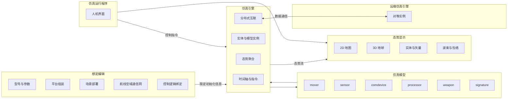

# Clockwork — 架构说明

本文档从**逻辑架构**角度描述各子系统职责、协作关系与典型数据流，不绑定具体类名与文件划分（实现阶段在 `lib/`、`cmd/` 中落地）。

---

## 1. 架构目标

- **想定驱动**：仿真前通过想定编辑产出型号、平台、场景部署、航线、空域、通信网与控制逻辑引用。
- **引擎为核心**：统一时间推进、实体生命周期、模型调度与态势聚合输出。
- **可分布式互联**：多个仿真引擎实例可跨主机数据通信，模型可与远端引擎侧的模型数据交互（联邦/分布式仿真）；**分布式模式下不提供快照**（快照仅本地单机，见 [api.md](api.md) 第 2.1 节）。
- **显示可替换**：态势显示消费引擎输出的态势数据，与二维地图 / 三维地球渲染解耦。
- **逻辑可脚本化**：实体行为由 Lua 或可视化蓝图驱动，引擎提供宿主与绑定。

---

## 2. 逻辑组件

| 组件 | 职责摘要 |
|------|----------|
| **想定编辑** | 注册模型、配置参数生成型号；编辑控制逻辑；航线/空域/通信网；组装平台（名称、2D 图标、3D 模型、属性）；部署到场景。 |
| **仿真引擎** | 读取限定信息初始化实体；处理控制指令（初始化、开始、暂停、结束、倍速）；驱动模型更新；输出态势；支持与远端引擎数据通信以实现分布式仿真。 |
| **仿真模型** | 按类型挂载到实体：`mover`、`sensor`、`comdevice`、`processor`、`weapon`、`signature`。 |
| **态势显示** | 2D/3D 视图；航线与空域；实体与坐标轴、速度/转动矢量；雷达/干扰波束与包络。 |
| **仿真运行程序** | 组合引擎与显示；人机交互（发送指令、视图操作等）。 |

---

## 3. 关键数据流

### 3.1 想定 → 引擎初始化

想定编辑产出**限定初始化信息**（实体列表、各实体挂载的模型与参数、初始位姿、网络拓扑、逻辑脚本引用等）。仿真引擎在「初始化」阶段消费该信息，创建运行时实体与模型实例。

### 3.2 控制指令 → 引擎状态机

运行程序（或外部控制器）向引擎发送：**初始化、开始、暂停、结束、设置仿真倍速**。引擎据此切换运行状态并驱动时间推进策略。

### 3.3 引擎 → 态势显示

引擎按仿真步长或按需聚合**仿真态势**（实体状态、探测结果、通信、武器事件、签名相关的可视化参数、波束几何等）。态势显示仅依赖该输出（及想定中的静态图层如航线、空域），避免显示层直接访问模型内部状态。

### 3.4 脚本 / 蓝图 ↔ 引擎

Lua 与可视化蓝图作为**控制逻辑宿主**：读取可暴露的实体状态、下发机动/传感器/武器/通信等意图（具体能力由模型与引擎 API 约定，见 [api.md](api.md)）。

### 3.5 分布式引擎 ↔ 远端引擎

各主机上的仿真引擎通过**数据通信**交换运行期信息，使本地挂载的模型能够消费或发布与**分布式模型数据**一致的内容（例如跨节点的实体状态、传感器可观测数据、通信载荷等）。具体报文语义、同步策略与时间对齐方式见 [api.md](api.md) 分布式一节。**联邦运行期间不提供快照保存/恢复**（与单机互斥，见 [api.md](api.md) 第 2.1 节）。

### 3.6 仿真时钟、浮点类型与确定性

- **权威仿真时钟**：实现中 `Engine` 的 `sim_time_`、`fixed_dt_`、`time_scale_` 均为 `double`；写入态势的 `SituationSnapshot::sim_time` / `time_scale` 与之一致（见 [api.md](api.md) 第 2.3 节）。
- **积分与几何**：每步传入机动等模型的标量步长为 `dt = static_cast<float>(fixed_dt_ * time_scale_)`；`Vec3` 及多数几何/运动中间量为 `float`。含义是：**时钟与累加用双精度减轻长期漂移**，**步内状态与带宽敏感路径保持单精度**。
- **步进公式与顺序（单机 `Running`）**：每步在模型调度之后执行 `sim_time_ += fixed_dt_ * time_scale_`，再调用 `aggregate_situation()` 填充实体态势并在末尾执行传感器探测；因此**当前帧快照中的 `sim_time` 已反映本步时钟增量**（与仅聚合、不 `step` 的路径一致）。
- **确定性**：在相同源码、工具链与输入想定下，固定步数应得到相同 IEEE 浮点结果；跨编译器/平台仍可能有细微差别。仓库提供 `cw::engine::situation_digest()`（对快照做规范排序后的 FNV-1a 摘要）及 `engine_tests` 中的**固定步数金样**回归；若有意变更数值行为，应同步更新金样并在提交说明中注明。

---

## 4. 仿真模型在架构中的位置

六类模型是**可组合能力单元**，同一实体可挂载多类模型实例：

- **mover**：运动学与动力学、航线跟随等。
- **sensor**：对环境中其他实体的探测与量测。
- **comdevice**：报文收发与链路约束。
- **processor**： onboard 处理、融合、决策输入等。
- **weapon**：发射与弹药/微波等交战相关行为。
- **signature**：可见光 / 红外 / 电磁等特征，供传感器与显示使用。

引擎负责**调度顺序**与**跨实体交互**（同一仿真步内的消息与探测一致性）。当前实现中，每步先按 `comdevice` → `processor` → `weapon` → `signature` → `mover` 调度，再在态势聚合末尾执行 **sensor**探测（`run_model_pass(Sensor)`），以便使用本帧更新后的位姿写入 `snapshot_.sensor_detections`。

---

## 5. 与实现工程的对应关系（规划）

| 逻辑组件 | 典型落地形式 |
|----------|----------------|
| 仿真引擎、模型宿主 | `lib/<引擎或核心库>/` |
| 想定编辑、仿真运行 | `cmd/<程序名称>/`（可多个可执行程序） |
| 态势显示与 UI 封装 | `lib/`中界面封装 + OpenGL 渲染（见 [development.md](development.md)） |

具体库名与拆分以仓库实际目录为准。

---

## 6. 相关文档

- 功能条目：[requirements.md](requirements.md)
- 接口契约：[api.md](api.md)
- 开发约束：[development.md](development.md)
